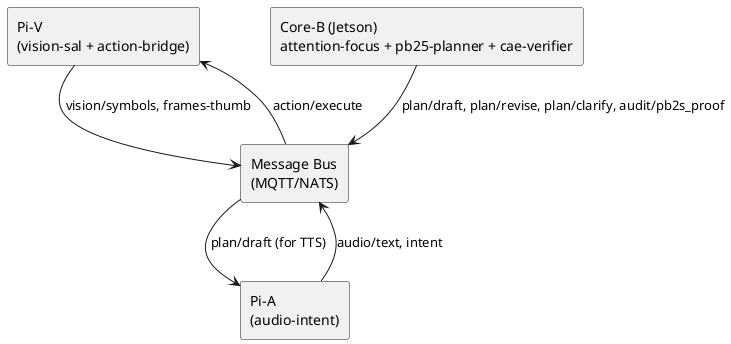
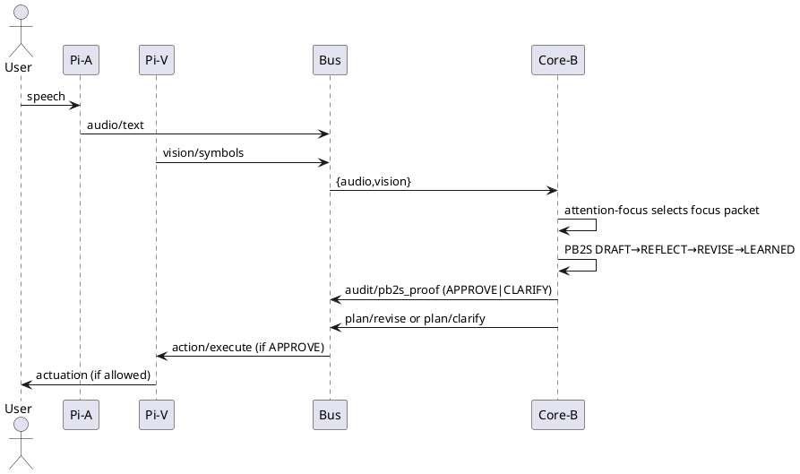

# SPEC-02 — PB2A “Newborn Head” (Jetson + Pi5) — Multi‑Node Cognitive Core; based on PB2S v0.2.1 — Four‑Step Structure (Normative Spec)
# It is mandatory to follow SPECIFICATION/PB2S_v0.2.1_spec_mandate.md
## Background

You want a **device-agnostic, private, repairable** cognitive core that runs the PB2S structure end‑to‑end on a small cluster (Jetson + 2× Raspberry Pi 5), with an **Attention/Focus controller** that arbitrates sensor streams, enforces policy, and keeps learning honest. The repo must be ready before hardware arrives and shift cleanly onto devices later.

## Requirements

**Must (M):**

* M1. Run **PB2S loop** before any external actuation/output.
* M2. Three boxes: **Pi‑V** (Vision/Action bridge), **Pi‑A** (Audio/intent), **Jetson Core‑B** (PB2S planner + CAE verifier + Attention/Focus).
* M3. **Message bus** with typed topics; deterministic, bounded‑latency routing on a private GBE switch.
* M4. **Safety/Policy gates**: no actuation unless PB2S `decision=APPROVE` + policy pass; `CLARIFY` yields questions only.
* M5. **Evidence trail**: per‑turn `pb2s_proof`, hashed artifacts (image/audio), and reproducible time-guard.
* M6. **Offline‑viable** (no cloud dependency for the critical path; models may be local/quantized).

**Should (S):**

* S1. Salvageable without Jetson: Pi‑only degraded mode.
* S2. Pluggable ASR/TTS/vision backends; ONNX/Torch runtimes.
* S3. Lightweight **salience/novelty** scoring to steer attention.

**Could (C):**

* C1. On‑device vector store for episodic memory.
* C2. Remote mirroring of logs via IPFS or SFTP when allowed.

**Won’t (W):**

* W1. No “hidden prompt masks” that bypass PB2S.

## Method

### 1) High‑level architecture

* **Pi‑V (Raspberry Pi 5)**

  * Inputs: cameras (CSI/USB), optional IMU.
  * Services: `vision-sal` (Symbol Abstraction Layer), `action-bridge` (HTTP/MQTT webhooks for actuators).
  * Publishes: `vision/symbols`, `vision/frames-thumb`.
  * Subscribes: `plan/draft`, `action/execute`.

* **Pi‑A (Raspberry Pi 5)**

  * Inputs: microphones; optional speaker for TTS.
  * Services: `audio-intent` (ASR → text; vad), `tts` (optional).
  * Publishes: `audio/text`, `audio/intent`, `sys/health/pi-a`.
  * Subscribes: `plan/draft` (for contextual TTS), `policy/notify`.

* **Jetson Core‑B**

  * Services: `attention-focus` (AF), `pb25-planner` (PB2S runtime), `cae-verifier` (contradiction/assumption/evidence checks), `memory-hub` (NVMe, 1 TB), `bus-gateway`.
  * Publishes: `plan/draft`, `plan/revise`, `plan/clarify`, `policy/decide`, `audit/pb2s_proof`.
  * Subscribes: `audio/text`, `vision/symbols`, `action/feedback`.

* **Message Bus** (single broker): MQTT (mosquitto) or NATS. Topics are namespaced and carry JSON payloads with `ts`, `source`, `sha256`, `payload`.

* **Network**: TL‑S105 GBE switch; static IPs; mDNS for discovery; hostnames `pi-v`, `pi-a`, `core-b`.

### 2) Topic schema (excerpts)

* `audio/text`: `{ ts, source:"pi-a", lang, text, vad:{start, end}, sha256_raw_audio }`
* `vision/symbols`: `{ ts, source:"pi-v", objects:[{label, conf, bbox}], scene:{light, motion}, sha256_frame }`
* `plan/draft`: `{ ts, id, context:{audio, vision}, draft_text }`
* `plan/revise`: `{ ts, id, revise_text, resolved:[idx], outstanding:[idx] }`
* `plan/clarify`: `{ ts, id, questions:[q1, q2] }`
* `audit/pb2s_proof`: PB2S proof object per your spec.
* `action/execute`: `{ ts, id, actions:[{name, params}], guard:{policy:true, pb2s:"APPROVE"} }`

### 3) Attention/Focus (AF) — “God\_relay\_brain”

**Goal:** arbitrate which inputs enter the PB2S loop this tick.

* **Inputs:** candidate events from `audio/text`, `vision/symbols`, timers.
* **Scoring:**

  * `S_salience` (novelty, motion, keyword hits),
  * `S_contradiction_risk` (recent REFLECT flags),
  * `S_priority` (user override/policy),
  * `S_recency` (age penalty),
  * compute `S_total = w1*salience + w2*risk + w3*priority - w4*age`.
* **Policy guard:** block sources while `policy=locked` (e.g., sensitive area, operator stop).
* **Output:** the **focus packet** (merged context) for PB2S: `{audio:text?, vision:symbols?}`.

**Time base:** 10 Hz scan; PB2S ticks at 1–2 Hz (bounded). AF maintains a ring buffer (`N=64`) for late binding.

### 4) PB2S runtime wiring

PB2S sits on Core‑B and is invoked by AF:

```text
FOCUS -> DRAFT (seed minimal answer)
       -> REFLECT (≤3 bullets; must flag contradiction/assumption/missing-evidence ≥1)
       -> REVISE (update; reference resolved bullets)
       -> LEARNED (append observed axiom)
       -> proof emitted to audit/pb2s_proof
```

**Escalation:** if contradictions persist after maxCycles=2, emit `plan/clarify` with exactly two questions and `decision=CLARIFY` in proof. Action bridge ignores commands unless `decision=APPROVE`.

### 5) Safety & actuation

* **Action Bridge (Pi‑V):** interprets `action/execute` only if `guard.policy=true` and latest proof for `id` is `APPROVE`. Else drop and publish `action/reject`.
* **Policy file:** YAML with allowlists/ratelimits; hot‑reload via `policy/notify`.
* **Deadman:** if no heartbeat from Core‑B or proofs stale >5s, action channel closes.

### 6) Storage & evidence

* **NVMe (Core‑B):** `/data/episodes/YYYY/MM/DD/HH/` with `index.jsonl` rows `{ts, msg_type, sha256, path}`.
* **Artifacts:** store thumbnails, audio snippets, proofs; compute SHA‑256 and include in bus messages.
* **Time‑guard:** the `08Apr2025_time_guard.md` procedure lives under `docs/challenges/`; scripts hash vendor screenshots + PB2S JSON and create a manifest.

### 7) Component diagram (PlantUML)



### 8) Sequence (one tick)



## Implementation

### Stack

* **OS:** Ubuntu L4T (Jetson), Raspberry Pi OS 64‑bit.
* **Runtime:** Python 3.10+, FastAPI + Uvicorn for `/chat`, paho‑mqtt or nats‑py.
* **ASR/TTS:** Whisper‑cpp or Vosk (offline), Piper for TTS.
* **Vision:** OpenCV + MobileNet/YOLOv8n (TensorRT/ONNX on Jetson; CPU fallback on Pi).
* **PB2S:** your current FastAPI `/chat` + `scripts/conformance.py` unchanged.

### Repo layout (device‑agnostic first)

```
/infra/
  docker/ (compose files per node)
  ansible/ (optional provisioning)
/services/
  core-b/ (AF, PB2S, CAE, memory)
  pi-v/   (vision-sal, action-bridge)
  pi-a/   (audio-intent, tts)
/bus/
  topics.md, schemas/
/docs/
  challenges/, ops/, safety/
```

### Pseudocode — Attention/Focus

```python
class AttentionFocus:
    def __init__(self, w=(0.4,0.3,0.2,0.1), decay=0.98):
        self.w1, self.w2, self.w3, self.w4 = w
        self.buffer = Ring(maxlen=64)
        self.flags = {}  # source -> recent contradiction risk

    def ingest(self, evt):
        evt.salience = novelty(evt) + keyword_hits(evt)
        evt.risk = self.flags.get(evt.source, 0.0)
        evt.priority = policy_priority(evt)
        evt.age = 0.0
        self.buffer.append(evt)

    def tick(self):
        for e in self.buffer:
            e.age = e.age*decay + 0.02
            e.score = self.w1*e.salience + self.w2*e.risk + self.w3*e.priority - self.w4*e.age
        focus = max(self.buffer, key=lambda e: e.score)
        return merge_context(focus, neighborhood(self.buffer, focus))

    def reflect_feedback(self, proof):
        # raise risk if contradictions were flagged
        has_flag = (proof.get('decision') == 'CLARIFY')
        for src in ['audio','vision']:
            self.flags[src] = min(1.0, 0.9*self.flags.get(src,0.0) + (0.2 if has_flag else 0.0))
```

### Safety gates (action bridge)

```python
def may_execute(proof, policy):
    return proof["decision"] == "APPROVE" and policy.allows()
```

### Deployment steps (no hardware yet)

1. **Create repo scaffolding** above; keep services as Docker images with `TARGET=sim`.
2. **Local simulate:** run `pi-a` (mic from file), `pi-v` (RTSP from file), `core-b` on your dev PC; use mosquitto locally.
3. **Conformance:** ensure `core-b` `/chat` passes `scripts/conformance.py`.
4. **Evidence:** produce a sample time‑guard bundle under `docs/challenges/`.
5. **When hardware arrives:**

   * Flash images; assign static IPs; set hostnames.
   * Deploy per‑node docker compose (`compose-core-b.yml`, `compose-pi-v.yml`, `compose-pi-a.yml`).
   * Point all to the bus broker on Core‑B.

## Milestones

* **M0:** Repo scaffold + simulated bus; PB2S passes conformance (Done from PB2S repo).
* **M1:** AF running with mocked streams; policy file hot‑reload.
* **M2:** Pi‑A ASR + Pi‑V symbolization online; proofs stored to NVMe.
* **M3:** Safe actuation demo with deadman + reject path.
* **M4:** Offline run for 24h; no safety violations; logs hashed.

## Gathering Results

* **Functional:** time to proof (< 500 ms median on Core‑B), `CLARIFY` rate under noise, action reject rate for policy breaches.
* **Safety:** zero actuation without `APPROVE` + policy.
* **Traceability:** every output has matching `pb2s_proof` and artifact hashes.
