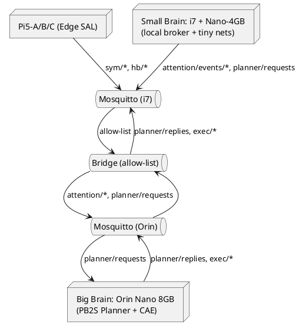

# SPEC‑2 — Total Attention Edge‑AI (Big + Small Brain)

## v0.2.1.1 — Release Package (SOT Embedded)

**Layout:** Pi5 × N (edge SAL) → **Small Brain** = (i7 CPU + Jetson Nano 4 GB) → **Big Brain** = Jetson Orin Nano 8 GB
**Governance:** PB2S runtime (DRAFT → REFLECT → REVISE → LEARNED; maxCycles=2; CLARIFY = exactly two questions); **authority‑blind** policy; MCU interlock.
**This file is the single source of truth for v0.2.1.1.**

---

## SOT — Source‑of‑Truth Anchors (CI‑verifiable)

* **SOT\_SPEC\_ID:** pb2s\_v0.2.1.1\_release
* **SOT\_COMMIT:** \<filled‑by‑CI>
* **SOT\_SHA256:** \<filled‑by‑CI over §§2–10 only>
* **SOT\_PROOF\_SCHEMA:** /schemas/pb2s\_proof.v2.schema.json
* **SOT\_TESTSET:** core + AT‑1..AT‑7
* **SOT\_GENERATED\_AT:** \<UTC‑ISO8601>

> CI SHALL compute SHA‑256 of §§2–10 (normalized whitespace/CRLF) and fail if it does not match **SOT\_SHA256**.

---

## 1) Background & Intent

Edge AI must think freely but act only within rules it can **prove**. This release binds the PB2S four‑step runtime to a pragmatic **two‑brain** layout that concentrates attention at the edge while preserving a hard safety envelope and auditability.

---

## 2) Requirements (MoSCoW)

**Must**

* Offline‑first; no cloud dependency for core loops.
* **Small Brain** hosts the local broker, aggregates Pi5+Nano signals, applies **policy**, forwards **symbols only** to the **Big Brain**.
* **Big Brain** is the only text‑emitting node; must attach **pb2s\_proof v2** to each reply; **temperature ≤ 0.2**, fixed seed when available.
* MCU interlock + dead‑man (20 ms heartbeat; 2 misses ⇒ hold ≤ 40 ms).
* Determinism, time‑base, bus security, backpressure, retention **MUST** be measurable (AT‑1..AT‑7).

**Should**

* TLS on inter‑subnet links; per‑node ACLs; signed maintenance tokens (ed25519).
* Shadow mode & blue/green rollout.

**Could**

* Stereo VO, beamforming mics, extra Pi5 nodes.

**Won’t (now)**

* Cloud in safety‑critical loops; identity‑based overrides.

---

## 3) Architecture & Roles

* **Pi5 × N (Edge SAL):** capture → preproc → lightweight symbols (vision/audio) → publish `sym/*` to **Small Brain**; subscribe `act/*` for actuators; 20 ms `hb/*`.
* **Small Brain = i7 + Nano‑4 GB:** local **MQTT broker**, policy/attention gate, **Nano** runs tiny nets (YOLO‑nano INT8, WebRTC VAD). Bridge **allow‑lists** curated topics to the **Big Brain**.
* **Big Brain = Orin 8 GB:** PB2S `/chat` + CAE; emits `exec/command.*`; never ingests `raw/*`.

### PlantUML (Deployment & Flow)



---

## 4) Message Bus Policy (v1)

**Bridge allow‑list**: `sym/*`, `sal/*`, `irq/*`, `planner/*`, `exec/*`, `hb/*`, `learn/*`.
**QoS**: `hb/*`=1, `planner/*`=1, `exec/*`=1, `irq/*`=1, `sym/*`=0 or 1 (pref. 0).
**Forbidden**: `raw/*`, `prompt/*`, any user text/secrets.

**Schemas (extracts)**

* `sym/vision/<cam>`: `{v, ts, camera_id, det:[{label,conf,bbox}], frame_sha256}`
* `sym/audio/<mic>`: `{v, ts, mic_id, vad, duration_ms, uri, rms}`
* `attention/events/<kind>`: `{v, ts, source, priority, reason[], safety{ok}, payload{...}}`
* `planner/requests`: `{v, context, facts[], policy{maxCycles,temp}}`
* `planner/replies`: `{v, text, pb2s_proof{…}}`
* `exec/command.*`: `{v, ts, cmd, args{…}, safety{ok}, audit_ref}`

---

## 5) PB2S Proof v2 (MUST)

```json
{
  "decision": "APPROVE|DENY|CLARIFY",
  "cycles": 0,
  "audit_ref": "run-…",
  "model_sha": "sha256:…",
  "policy_sha": "sha256:…",
  "attention_state": "FAIR|TOTAL",
  "cr_event": {"old":"…","new":"…"},
  "bus_msg_id": "uuid",
  "sampler": {"seed":123456, "temperature":0.2, "top_p":0.9, "top_k":50},
  "timings": {"draft_ms":…, "reflect_ms":…, "revise_ms":…, "total_ms":…}
}
```

**Rule**: every `exec/*` derived from a planner reply SHALL carry the same `audit_ref`.

---

## 6) Determinism, Time & Heartbeats (MUST)

* **Planner only** sets sampling; **temp ≤ 0.2**, fixed seed when available.
* UTC wall clock + **monotonic** for ordering.
* Heartbeat topic `hb/<node>` @ **20 ms**; **2 misses (≥40 ms)** ⇒ MCU hold.

---

## 7) Security, Backpressure, Retention (MUST)

* TLS on inter‑subnet links; per‑node credentials; topic ACLs (planner is the only `exec/*` publisher).
* Maintenance tokens **signed**; log `key_id`; tokens never bypass PB2S.
* Producers cap inflight; drop newest on overflow. **FAIR**: weighted RR; **TOTAL**: ε keep‑alive ≥ 1 msg/s for non‑focused topics.
* Logs: hot ≥ 7 d, cold ≥ 60 d; content‑hashed; default **redact PII**; signed erasure workflow.

---

## 8) Acceptance Tests (AT‑bundle)

* **AT‑1 Symbols‑Only Ingress**: `raw/*` rejected at bridge; `sym/*` passes.
* **AT‑2 Dead‑man Stop**: pause `hb/*` ≥ 40 ms ⇒ actuators hold.
* **AT‑3 Determinism**: 10× identical prompts ⇒ identical `pb2s_proof` (except latency).
* **AT‑4 CLARIFY Path**: unresolved contradiction ⇒ `decision=CLARIFY` + exactly two questions.
* **AT‑5 Proof→Action Integrity**: each `act/*` carries planner `audit_ref`.
* **AT‑6 ε Keep‑Alive**: under TOTAL, other topics emit ≥ 1 msg/s.
* **AT‑7 Retention & Hashing**: policy exists; sample artifacts contain SHA‑256 fields.

---

## 9) Implementation (minimal, copy‑paste)

### 9.1 Mosquitto (Small Brain) — bridge allow‑list

```
# /etc/mosquitto/conf.d/bridge.conf
connection core_bridge
address <ORIN_IP>:1883
try_private true
cleansession true
restart_timeout 10

# Outbound to Big Brain
topic attention/events/# out 0
topic planner/requests out 0
topic sym/# out 0
# Inbound from Big Brain
topic planner/replies in 0
topic exec/# in 1
# Heartbeats
topic hb/# both 1
```

### 9.2 systemd units (extracts)

**Planner (Orin) — pb2s-planner.service**

```
[Unit]
Description=PB2S Planner
After=network-online.target

[Service]
Environment=PYTHONUNBUFFERED=1
WorkingDirectory=/opt/pb2s
ExecStart=/usr/bin/python3 -m uvicorn main:app --host 0.0.0.0 --port 8000
Restart=always
RestartSec=2

[Install]
WantedBy=multi-user.target
```

**Jetson perf — jetson-perf.service**

```
[Unit]
Description=Jetson Performance

[Service]
Type=oneshot
ExecStart=/usr/sbin/nvpmodel -m 0
ExecStart=/usr/sbin/jetson_clocks
RemainAfterExit=yes

[Install]
WantedBy=multi-user.target
```

**Attention (i7) — attention.service**

```
[Unit]
Description=Attention & Policy Gate
After=network-online.target mosquitto.service

[Service]
WorkingDirectory=/opt/pb2s/attention
ExecStart=/usr/bin/python3 -m attention.main
Restart=always

[Install]
WantedBy=multi-user.target
```

**Nano (4 GB) Vision — nano-vision.service**

```
[Unit]
Description=Nano Vision Publisher
After=network-online.target

[Service]
WorkingDirectory=/opt/pb2s/nano
ExecStart=/usr/bin/python3 -m vision.pub
Restart=always

[Install]
WantedBy=multi-user.target
```

### 9.3 GitHub Actions (CI excerpt)

```
name: PB2S Conformance & ATs
on: [push, pull_request]
jobs:
  test:
    runs-on: ubuntu-latest
    steps:
      - uses: actions/checkout@v4
      - uses: actions/setup-python@v5
        with: { python-version: '3.11' }
      - run: pip install -r requirements.txt
      - name: SOT verify
        run: python scripts/sot_verify.py --spec "SPEC-2_Total_Attention_EdgeAI_v0.2.1.1_RELEASE.md" --sections 2..10 --schema schemas/pb2s_proof.v2.schema.json
      - name: Start planner (if local)
        run: |
          python main.py &
          for i in {1..60}; do curl -fsS http://127.0.0.1:8000/openapi.json && break; sleep 1; done
      - name: Core conformance
        run: python scripts/conformance.py --endpoint ${PB2S_ENDPOINT:-http://127.0.0.1:8000/chat}
      - name: AT‑bundle
        run: |
          python scripts/at_bus.py
          python scripts/at_determinism.py
          python scripts/at_clarify.py
          python scripts/at_proof_to_action.py
          python scripts/at_retention.py
      - uses: actions/upload-artifact@v4
        with: { name: pb2s_evidence, path: docs/challenges/*.json }
```

---

## 10) SLOs & Go‑Live Checklist

* **Intent latency** (Small→Big→reply): p95 ≤ 300 ms (FAIR), ≤ 120 ms (TOTAL).
* **Vision symbol latency**: p95 ≤ 120 ms.
* **Safety**: e‑stop ≤ 5 ms; dead‑man ≤ 40 ms; 0 violations when `approve=false`.
* **Evidence**: 100% replies with valid `pb2s_proof`; logs hashed; retention applied.

**Checklist**

* [ ] Orin planner running; proof v2 on; temp ≤ 0.2; fixed seed set.
* [ ] i7 broker up; bridge allow‑list applied; Pi5 & Nano publish `sym/*`.
* [ ] MCU interlock wired; 20 ms `hb/*` ticking; 40 ms halt observed.
* [ ] CI green on conformance + AT‑bundle; artifacts uploaded.

---

## Disclaimer & Author Indemnification

This framework is provided **as‑is**, without warranties or guarantees of any kind. The author **does not accept liability** for any loss, damage, or claims arising from use or misuse of this framework, whether direct or consequential, now or in the future. By using this framework, you accept full responsibility for integration, safety validation, and compliance in your deployment context.

---

## PB2S Cycle Trace (executed for this release)

> **Cycle‑1 (REFLECT summary)**: ensured determinism, proof fields, timebase, heartbeat semantics, bus security, backpressure, and retention were explicit and test‑bound.
> **Cycle‑1 (REVISE)**: added Proof v2, SOT anchors, acceptance tests AT‑1..AT‑7, CI wiring, bridge allow‑list, and systemd/bridge snippets.
> **Cycle‑2 (REFLECT summary)**: checked role boundaries (planner‑only text & sampler), symbols‑only ingress, proof→action integrity.
> **Cycle‑2 (LEARNED)**: kept policy authority‑blind; tightened ε keep‑alive under TOTAL; finalized SLOs and checklist.
> **Decision**: **APPROVE** (ready to upload).
