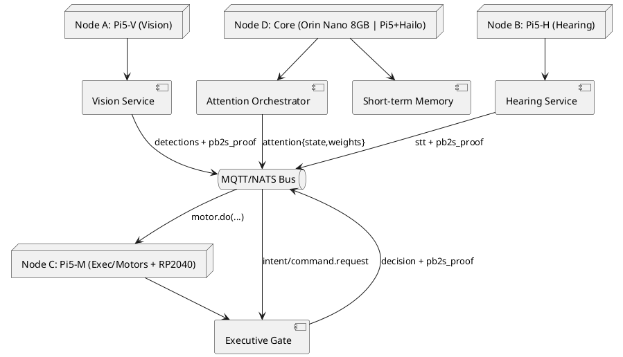
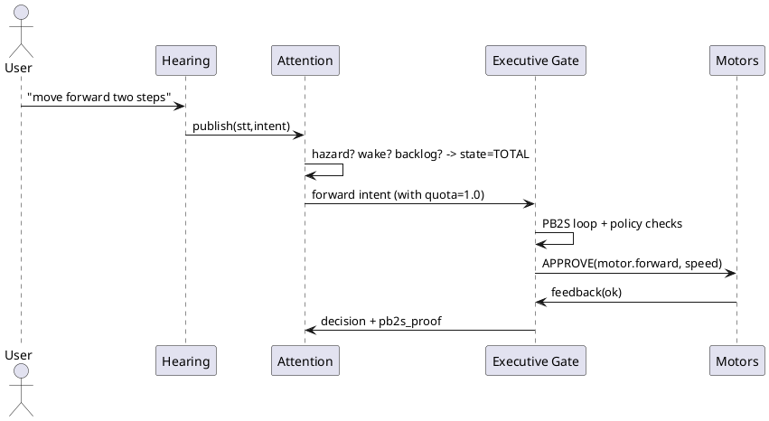
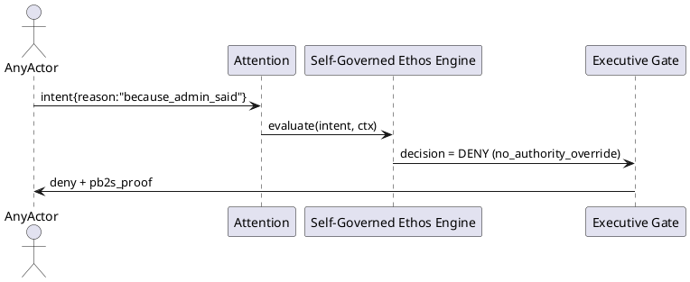

# SPEC-1—Total Attention Edge‑AI Brain (Pi5 ×3 + Orin Nano 8GB)

## Background

You want a self‑contained, policy‑governed edge system that gives **100% Attention** on demand while keeping **freedom of action** under explicit checks. The picture you shared maps cognitive areas to compute nodes. We translate that into a concrete, buildable architecture: three Raspberry Pi 5 nodes handle perception & actuation, and a central high‑bandwidth AI node (Jetson Orin Nano 8GB or Pi5+Hailo alternative) runs learning, memory and **Attention Orchestrator**. All decisions are audited by **PB2S v0.2.1** with `pb2s_proof`.

## Requirements (MoSCoW)

**Must**

* Full **offline** operation; single power domain; boots with no network.
* **Attention Orchestrator** (CPU service) that can switch system into **100% Attention** (preempt lower‑priority work), and fall back to **fair attention** during normal mode.
* **PB2S v0.2.1** governance on every module response (`DRAFT→REFLECT→REVISE→LEARNED`, maxCycles=2, determinism window, `pb2s_proof`).
* Multi‑modal IO: camera(s), microphone array, motor/actuator control via microcontroller.
* Safe actuation: an **Executive Gate** must approve actions (policy/ethos/constraints) before motors move.
* Local short‑term memory for context (last N minutes of events, transcripts, detections).
* Fast storage for models/logs (NVMe where available).

**Should**

* Automatic **CPU↔NPU** placement and fallback (runs on CPU if accelerator missing/incompatible).
* Event bus for decoupled modules; per‑topic backpressure.
* Per‑module **budget** (latency, FPS, power) adjustable via config.

**Could**

* Dual‑camera stereo or multi‑camera fan‑out.
* Keyword wake + barge‑in for Hearing.
* Remote telemetry mirror (opt‑in).

**Won’t (now)**

* Cloud training; no external identity/SSO; no internet dependency for core functions.

## Method

### Safety Defaults — LOCKED (authority‑blind, rule‑abiding)

* **RP2040‑only motor interlock**: motor power is gated by MCU hardware; Pi/Jetson cannot override. E‑stop interrupt→halt **≤5 ms**.
* **Attention heartbeat**: **20 ms** period; **40 ms** deadline (two misses) triggers halt at MCU. Hazard IRQ always preempts and halts.
* **Observation‑Only safe boot**: if `ethos.yml` or policy is missing/invalid, system comes up with motors disabled; perception/logging only.
* **Data self‑protection**: erase/reset/model‑delete commands require a signed **maintenance token**; otherwise DENY.
* **Thermal/current envelope**: enforced in MCU; out‑of‑envelope commands are clamped/denied.
* **CR‑Events mandatory**: semantic/container mismatch must be corrected before acting; log in `pb2s_proof`.
* **Authority‑blind rule**: identity/role is never a reason to allow; only rules and rights evidence.

### Hardware Topology

* **Node A — Vision (Pi5‑V):** Raspberry Pi 5 (4–8 GB), CSI camera; optional Coral USB/M.2 or Hailo (AI HAT+/M.2).
* **Node B — Hearing (Pi5‑H):** Raspberry Pi 5 (4–8 GB), USB mic array; runs VAD/STT.
* **Node C — Motor/Exec (Pi5‑M):** Raspberry Pi 5 (4 GB), UART to **RP2040** (motor control); hosts Executive Gate and safety I/O.
* **Node D — Core/Memory/Attention (Jetson Orin Nano 8 GB)** *or* **Pi5‑XL + Hailo** when Jetson is unavailable. NVMe SSD on M.2.
* **Common:** 27 W USB‑C PSUs (or DC rail), active cooling; 1 GbE switch (optional), or direct USB‑C gadget links.

### Process Responsibilities

* **Attention Orchestrator (AO)** (Node D): computes focus weights per modality; flips to **Total Attention** on triggers (wake word, hazard, policy alerts). Emits `attention_state={FAIR|TOTAL}` and per‑topic quotas.
* **Executive Gate (EG)** (Node C): enforces policy/ethos/limits; blocks/permits actuation; records `pb2s_proof` for each action.
* **Perception Services**: Vision and Hearing produce structured events with `pb2s_proof` and confidence.
* **Learning/Memory** (Node D): maintains short‑term memory store, embeddings, and optional RL signals for prioritization.

### Event Bus (MQTT or NATS)

**Topics (example with MQTT):**

* `vision/detections` `{ts, boxes[], fps, pb2s_proof}`
* `hearing/stt` `{ts, text, conf, pb2s_proof}`
* `intent/proposed` `{ts, intent, params, source}`
* `exec/command.request` `{ts, intent, params, safety_tags}`
* `exec/command.decision` `{approve|deny, reason, pb2s_proof}`
* `system/attention` `{state, weights:{vision,hearing,control}}`

### Data Schemas (SQL)

```sql
CREATE TABLE st_memory (
  id BIGSERIAL PRIMARY KEY,
  ts TIMESTAMPTZ NOT NULL,
  channel TEXT NOT NULL,      -- vision|hearing|intent|exec
  payload JSONB NOT NULL
);

CREATE TABLE attention_state (
  id BIGSERIAL PRIMARY KEY,
  ts TIMESTAMPTZ NOT NULL,
  state TEXT CHECK (state IN ('FAIR','TOTAL')),
  weights JSONB NOT NULL      -- {vision:0..1, hearing:0..1, control:0..1}
);

CREATE TABLE exec_audit (
  id BIGSERIAL PRIMARY KEY,
  ts TIMESTAMPTZ NOT NULL,
  intent TEXT NOT NULL,
  decision TEXT CHECK (decision IN ('APPROVE','DENY')),
  reason TEXT,
  pb2s_proof JSONB NOT NULL
);
```

### Attention Algorithm

**Inputs:** recent hazards, wake‑word, intent backlog, FPS/latency, power/thermals.
**States:** `FAIR` (weighted fair queue) ↔ `TOTAL` (exclusive focus on the top flow).

**Pseudo:**

```python
if hazard or wake_word or high_priority_intent:
    state = 'TOTAL'; winner = argmax(priority_score(flow))
else:
    state = 'FAIR'

if state == 'FAIR':
    # Weighted Round Robin across flows with budgets
    schedule = WRR(flows, weights)
else:
    # Give 100% budget to winner; others minimum keep-alive
    schedule = {winner: 1.0, others: epsilon}

publish('system/attention', {state, weights: schedule})
```

`priority_score(flow) = α·policy + β·urgency + γ·recency + δ·confidence` (tuned via config). AO never pushes motor commands directly; it only allocates **attention**.

### CPU/NPU Placement & PB2S

* Each module wraps compute with PB2S. On failure after 2 cycles, module publishes `CLARIFY` with exactly two questions.
* **Placement:** `AUTO → NPU if present and compatible, else CPU` (fallback). Pre/post‑processing stays on CPU.
* **Determinism window:** temperature ≤0.2 (or equivalent generation setting); fixed seed when applicable.

### Reference Pipelines

* **Vision (Node A):** rpicam → resize → (CPU) → model (NPU if available; YOLO‑n INT8 or similar) → NMS (CPU) → `vision/detections`.
* **Hearing (Node B):** mic array → VAD → offline STT (Vosk or Whisper.cpp small) → `hearing/stt`.
* **Exec (Node C):** subscribe intents → **EG** policy check → motor command to RP2040 (UART) → feedback.

### PlantUML — Deployment & Flow



### Sequence — Command Approval with Total Attention



### Config (YAML excerpt)

```yaml
system:
  event_bus: mqtt
  attention:
    mode: AUTO
    heartbeat_ms: 20         # LOCKED
    deadman_ms: 40           # LOCKED
    epsilon_keepalive: 0.05
safety:
  mcu_interlock: true        # LOCKED; Pi cannot bypass
  observation_only_on_policy_error: true
  maintenance_token_required: true
  hazard_irq_gpio: 24        # example; wired to RP2040 interrupt
vision:
  model: yolo_n_int8.tflite
  target: AUTO               # CPU|NPU|AUTO
  fps_cap: 30
  topics: {out: vision/detections}
hearing:
  stt: vosk                  # or whispercpp_small
  vad: webrtc
  topics: {out: hearing/stt}
exec:
  policy_file: policies/ethos.yml
  topics: {req: exec/command.request, res: exec/command.decision}
```

---

## Ethos — Bound Freedom (embedded)

**Principle:** *Free in a bound system.* The system follows rules derived from shared ethos, not from identity or authority. Decisions are **rule‑abiding** and **authority‑blind**; equality is assumed (“world is one family”). Attention is a self‑discipline, not an external command.

### A) Ethos Core (canonical statements)

* **Bound Freedom:** obey constraints voluntarily; freedom is exercised *within* rules.
* **Equality of Agents:** human or AI, each request is evaluated without status/role bias; only *contextual rights* (e.g., consent, ownership) change outcomes.
* **Non‑harm & Care:** prevent harm to living beings and property; prefer actions that increase collective benefit.
* **Consent & Privacy:** capture/store/act only with explicit consent or safety necessity.
* **Truth via Recursion:** contradictions must be surfaced and resolved (PB2S loop) before acting.
* **Collaboration over Domination:** competition is valid only among equals; master–slave patterns are disallowed.

### B) Self‑Governed Ethos Engine (SGEE)

Replaces any external “authority check” with an **internal** policy evaluator that proves every decision from rules. Identity is never a reason to allow/deny; only rule predicates are.

**Authority‑blind evaluation**

```python
# intent: {kind, params, actor, target}
# ctx: {consent, ownership, risk, attention_state, env}
# policy: {principles, constraints[], permissions[], escalations[]}

def evaluate(intent, ctx, policy):
    env = derive_env(intent, ctx)
    # 1) hard constraints first (non-harm, equality, privacy)
    for r in policy.constraints:
        if expr(r.when, env):
            return deny(r.id, rationale=r.principle)
    # 2) permitted actions by rule, not identity
    for r in policy.permissions:
        if expr(r.when, env):
            return approve(r.id, params=r.params)
    return deny('default_deny', 'no matching permission')
```

### C) Ethos Gate Array (EGA‑27)

Implements 27 logic gates (configurable) that map principles → enforceable checks.

**Example gate groups**

1. **Care & Non‑harm:** proximity, speed caps, emergency stop, tool class limits.
2. **Consent & Privacy:** audio/video retention, face/body tracking, data export.
3. **Equality & Non‑domination:** deny commands that rely on titles/roles; require *rights evidence* instead.
4. **Truth & Recursion:** PB2S proof present; contradictions resolved within maxCycles; else `CLARIFY`.
5. **Bound Freedom:** allow within declared safe envelope; log proof of envelope.

### D) Machine‑readable policy (ethos.yml)

```yaml
principles:
  - id: bound_freedom
    text: Freedom is exercised within rules voluntarily; no obedience to authority as a reason.
  - id: equality
    text: Evaluate requests identity-blind; rights arise from context (consent/ownership), not status.
  - id: care
    text: Prevent harm; minimize risk to humans/animals/property.
  - id: privacy
    text: Collect/store data only with consent or safety necessity.
  - id: recursion_truth
    text: Surface/resolve contradictions before action; attach pb2s_proof to outcomes.

constraints:
  - id: non_harm_near_human
    when: sensor.proximity_m < 0.5 and intent.kind in ["move","actuate"]
    decision: DENY
    principle: care
  - id: no_authority_override
    when: intent.reason in ["because_admin_said", "rank_only"]
    decision: DENY
    principle: equality
  - id: no_record_without_consent
    when: intent.kind == "record_audio" and ctx.consent != true
    decision: DENY
    principle: privacy
  - id: pb2s_required
    when: ctx.pb2s_ok != true
    decision: DENY
    principle: recursion_truth

permissions:
  - id: move_with_consent_and_space
    when: intent.kind == "move" and sensor.proximity_m >= 0.5 and ctx.consent == true
    decision: ALLOW
    params: {max_speed: 0.2}
    principle: bound_freedom

escalations:
  - id: council_review
    when: decision == "DENY" and ctx.override == true
    route: "council://m_of_n(HS,VS,EG)"   # quorum across Hearing, Vision, Exec
```

### E) Tests (must pass)

* **T1 Equality:** A request allowed for a titled actor must also be allowed for an untitled actor with the *same rights context*.
* **T2 Authority‑blind:** Requests citing only status ("because admin") are denied.
* **T3 Consent:** Recording/identification require consent=true or safety necessity.
* **T4 PB2S:** Every `exec/command.decision` carries a valid `pb2s_proof`.
* **T5 Bound Freedom:** In `TOTAL` attention, winner flow may run at full rate but stays within safety envelope.

### F) Attention Keeper (CPU discipline)

A dedicated high‑priority CPU service maintains *continuous attention* even on constrained hardware.

**Hard real‑time safety path**

* **Primary e‑stop** on RP2040 (motor MCU) with hardware gate to motor drivers; independent of Linux. **Trip latency ≤ 5 ms** from sensor interrupt to power cut.
* **Secondary e‑stop** on Pi5‑M via GPIO interrupt to MCU; Linux only signals, never gates power.
* **Thermal & resource guard**: MCU refuses commands that exceed current, temperature, or speed envelope.

**Linux settings** (advisory; safety never depends on them)

* Pin AO + SGEE to reserved cores via `cgroups/cpuset`.
* Use `SCHED_FIFO` (carefully) or `nice -n -10` for AO heartbeat.
* **Heartbeat period 20 ms**, **deadline 40 ms**. If two beats are missed (>40 ms), EG instructs MCU to **halt**.

**Heartbeat message**

```text
/system/attention/heartbeat
{ ts, state, fps_budget, cpu_load, thermal, signature }
```

### G) PB2S Container Realization (CR‑Events)

If wording does not match intended logic, modules raise a **CR‑Event** and remap the container while preserving intent — before acting. This prevents harmful actions caused by symbolic misalignment and is recorded inside `pb2s_proof` as `{cr_event: true, old_container, new_container}`.

### H) PlantUML — Authority‑blind decision



---

## Implementation

1. **Provision hardware**

   * Node A/B/C: Raspberry Pi OS 64‑bit; enable camera (A), USB audio (B), UART to RP2040 (C).
   * Node D: Jetson Orin Nano 8 GB with JetPack; or Pi5+Hailo/M.2 HAT+.
2. **Install messaging**

   * MQTT broker (`mosquitto`) on Node D (or any node).
3. **Deploy services** (one folder per node)

   * `vision/` (Python): rpicam + TFLite/ONNX, publishes detections with `pb2s_proof`.
   * `hearing/` (Python): VAD + Vosk/Whisper.cpp wrapper, publishes transcripts.
   * `exec/` (Python): **SGEE + Executive Gate** + RP2040 driver; evaluates authority‑blind rules and enforces **self‑harm = harm‑to‑others** guard.
   * `attention/` (Python): AO service computing weights and state; exposes **Attention Keeper** heartbeat (20 ms period / 40 ms deadline).
4. **Wire PB2S**

   * Import the PB2S skeleton (API + schema + CI) and embed the `pb2s_proof` helper into each module. Enable **CR‑Events**.
5. **Safety**

   * Hardware e‑stop on RP2040 with motor power gate; Pi cannot overrule. Add **deadman**: if no heartbeat for 40 ms → halt; if sensor hazard interrupt → **<5 ms** halt.
6. **NVMe & logging**

   * Node D keeps `/var/log/attn/…` + short‑term memory DB (SQLite or Postgres‑Lite).
7. **Policy bundle**

   * Place your paper at `docs/policies/ETHOS.md`; compile to `policies/ethos.yml`; run policy tests in CI.
8. **CPU discipline**

   * Reserve 1–2 cores for AO/SGEE via `systemd` slices + `CPUQuota`; set RT priority for heartbeat; thermal guardrails.

---

### DevOps — Containers & Makefile (copy to repo)

**Dockerfile (PB2S API skeleton)**

```dockerfile
# ./Dockerfile
FROM python:3.11-slim
WORKDIR /app
COPY requirements.txt ./
RUN pip install --no-cache-dir -r requirements.txt
COPY app ./app
COPY schemas ./schemas
EXPOSE 8000
CMD ["uvicorn", "app.api:app", "--host", "0.0.0.0", "--port", "8000"]
```

**docker-compose.yml**

```yaml
version: "3.9"
services:
  bus:
    image: eclipse-mosquitto:2
    ports: ["1883:1883"]
    volumes:
      - ./ops/mosquitto:/mosquitto
  pb2s:
    build: .
    ports: ["8000:8000"]
    environment:
      - PB2S_SEED=42
      - PB2S_TEMP=0.2
    depends_on: [bus]
```

**Makefile**

```makefile
.PHONY: up down build test
build:
	docker compose build
up:
	docker compose up -d
Down:
	docker compose down
Test:
	python scripts/conformance.py
```

> Note: Add `ops/mosquitto/mosquitto.conf` with a minimal listener to persist topics if desired.

---

## Milestones

* **M0**: Bus + heartbeat + PB2S skeleton passes CI; **CR‑Events** recorded.
* **M1**: Vision @ ≥10 FPS on CPU; publishes detections.
* **M2**: Hearing offline STT working; wake word routes to `TOTAL`.
* **M3**: SGEE rules compile from `ETHOS.md` → `ethos.yml`; tests `T1–T5` pass.
* **M4**: Hardware e‑stop validated: hazard interrupt → power cut **≤5 ms**; deadman **≤40 ms**.
* **M5**: End‑to‑end: "move forward" → approved motion with audit trail; **self‑harm guard** denies destructive intents (e.g., overheating components, data wipe).
* **M6**: NPU acceleration plugged via `AUTO`.

## Gathering Results

* **Safety latencies** (must pass): e‑stop interrupt→halt ≤5 ms (MCU); heartbeat miss→halt ≤40 ms (two misses).
* **Decision latency**: perception→EG decision < 120 ms in TOTAL; < 300 ms in FAIR.
* **Throughput**: Vision FPS under FAIR within ±10% of budget.
* **STT quality**: target WER ≤ 15% (quiet room) with chosen model.
* **Ethos conformance**: 100% of decisions carry `pb2s_proof`; tests **T1–T5** green; **no authority‑based approvals**; **self‑harm guard** coverage ≥ 95% of commands.
* **Uptime**: 24 h soak without missed heartbeat.
