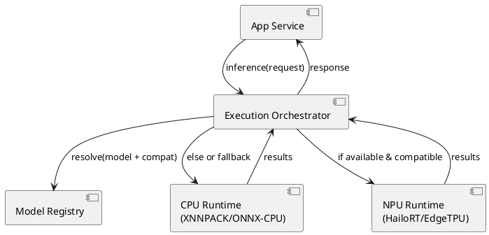
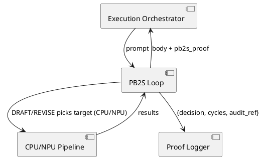

# SPEC-1-Edge-AI — CPU Support Slice

## Method — CPU Support in Schema & Runtime (PB2S_v0.2.1_spec_mandate.md applicable)

**Assumptions (can be changed):**

* Hardware: Raspberry Pi 5 (8 GB), optional NPU (USB Coral / Hailo via AI HAT+ or M.2).
* Workloads: real-time CV (detection/segmentation); single-camera input first.
* OS: Raspberry Pi OS 64-bit.
* Frameworks: ONNX Runtime **or** TFLite (we’ll keep both paths open).

**Goals:**

* CPU-first correctness with **automatic NPU offload** when present.
* Seamless **fallback to CPU** on model/driver incompatibility.
* Optional **hybrid**: CPU handles pre/post-processing; accelerator runs the core model.
* Telemetry-guided scheduling (temperature, power, utilization caps).

---

### 1) Config Schema (app-level)

Use a single config to control placement, fallback, and limits.

```yaml
compute:
  default_target: AUTO   # CPU | NPU | GPU | AUTO
  cpu:
    threads: 4           # 0=auto
    delegate: XNNPACK    # for TFLite path; ONNX uses CPUExecutionProvider
  npu:
    provider: hailo | edgetpu | none
    precision: INT8      # INT8|FP16 depending on NPU
    batch_size: 1
fallback:
  on_missing_delegate: CPU
  on_model_incompatible: CPU
  on_overtemp: CPU
scheduling:
  policy: LATENCY_FIRST  # or THROUGHPUT_FIRST
  max_cpu_utilization: 0.75
  max_temperature_c: 80
  power_mode: NORMAL     # TURBO|BATTERY
models:
  - name: yolo-det-int8
    format: tflite
    targets: [CPU, NPU]
    input: {shape: [1, 640, 640, 3], dtype: uint8}
    path: /models/yolo-det-int8.tflite
```

---

### 2) Minimal Data Model (DB)

Tracks device capabilities, artifacts, and live performance to inform placement.

```sql
CREATE TABLE device_capability (
  id SERIAL PRIMARY KEY,
  cpu_arch TEXT,
  cpu_cores INT,
  isa TEXT,                 -- e.g., NEON
  npu_vendor TEXT,          -- edgetpu|hailo|null
  npu_tops REAL,
  npu_precision TEXT,
  ram_mb INT,
  pcie_gen TEXT,
  updated_at TIMESTAMP DEFAULT NOW()
);

CREATE TABLE model_artifact (
  id SERIAL PRIMARY KEY,
  name TEXT UNIQUE,
  format TEXT,              -- tflite|onnx
  precision TEXT,           -- INT8|FP16|FP32
  size_mb REAL,
  compatible_targets TEXT,  -- e.g., '{CPU,NPU}'
  input_spec JSONB,
  path TEXT,
  checksum TEXT
);

CREATE TABLE runtime_metric (
  id SERIAL PRIMARY KEY,
  model_id INT REFERENCES model_artifact(id),
  target TEXT,              -- CPU|NPU
  batch_size INT,
  latency_ms REAL,
  throughput_fps REAL,
  accuracy FLOAT,
  temperature_c REAL,
  timestamp TIMESTAMP DEFAULT NOW()
);
```

---

### 3) Execution Logic (pseudocode)

```python
def choose_target(model_name, cfg, caps, temp):
    desired = cfg.compute.default_target
    compat = lookup_model_targets(model_name)

    def ok_for_npu():
        return (
            'NPU' in compat and
            caps.npu_vendor is not None and
            temp < cfg.scheduling.max_temperature_c
        )

    if desired == 'AUTO':
        return 'NPU' if ok_for_npu() else 'CPU'

    if desired == 'NPU' and not ok_for_npu():
        return cfg.fallback.on_model_incompatible  # CPU

    return desired  # 'CPU' or forced 'NPU'
```

**Pre/Post pipeline (hybrid):**

* CPU: image capture → resize/letterbox → color convert → NMS
* NPU: core forward pass
* CPU: light postproc, business logic → outputs

---

### 4) Runtime API (so components can request CPU/NPU cleanly)

```http
POST /infer
{
  "model": "yolo-det-int8",
  "target": "AUTO",           // CPU|NPU|AUTO
  "inputs": { "image": "base64..." }
}

200 OK
{
  "used_target": "CPU",       // actual placement selected by orchestrator
  "latency_ms": 38.5,
  "detections": [ ... ]
}
```

---

### 5) Component Diagram (PlantUML)



---

### 6) Notes

* Keep **CPU path always runnable** (reference FP32/INT8 model for CPU with XNNPACK/ONNX-CPU).
* Log every decision (why CPU vs NPU): aids debugging & perf tuning.
* Thermal guardrail: if temperature rises above threshold, **throttle to CPU** or reduce FPS.

---

## Governance — PB2S v0.2.1 Conformance

**Objective.** Bake a pre‑emission self‑audit into the runtime so every API reply carries a `pb2s_proof` and the four‑step loop is verifiable.

**Runtime behavior (contract we implement):**

* **Loop:** `DRAFT → REFLECT → REVISE → LEARNED` before emitting the user‑visible body; **maxCycles=2**; failure to resolve contradictions triggers a **CLARIFY** response with exactly two questions.
* **Determinism window:** temperature ≤ **0.2**, fixed seed if available.
* **Trace logging:** persist `{timestamp, model_id, prompt_hash, pb2s_proof}` per exchange.

### A) API shape (augment existing endpoints)

```http
POST /chat
{
  "prompt": "...",
  "context": { /* app context */ }
}

200 OK
{
  "body": {
    "section": "REVISED ANSWER TEXT HERE"
  },
  "pb2s_proof": {
    "decision": "APPROVE|CLARIFY",
    "cycles": 0,
    "audit_ref": "run-20250911-135501-1f2b..."
  }
}
```

### B) Database additions

```sql
CREATE TABLE pb2s_proof_log (
  id SERIAL PRIMARY KEY,
  audit_ref TEXT NOT NULL,
  decision TEXT CHECK (decision IN ('APPROVE','CLARIFY')),
  cycles INT CHECK (cycles BETWEEN 0 AND 2),
  prompt_hash TEXT NOT NULL,
  model_id TEXT,
  payload JSONB,
  created_at TIMESTAMP DEFAULT NOW()
);
```

### C) Orchestrator integration (pseudocode)

```python
for cycle in range(0, 2):  # maxCycles=2
    draft = generate_draft(prompt, temp=0.2, seed=SEED)
    issues = reflect(draft)  # returns list from {contradiction, unjustified_assumption, missing_evidence}
    if not issues:
        body = revise(draft, resolved=issues)
        return approve(body)
    draft = revise(draft, resolved=issues)

# if we reach here, contradictions persist
return clarify(two_questions(prompt))
```

### D) Conformance harness (repo tasks)

* Add `schemas/pb2s_proof.schema.json` and validate response objects.
* Add `scripts/conformance.py` that posts 3–5 prompts to `/chat` and verifies: section order, REFLECT ≤3 bullets, proof schema, CLARIFY rule and exactly two questions.
* CI job exits **0** on pass, non‑zero on fail; store artifacts (proof logs) for audits.

### E) PlantUML — audit path inside runtime



---

### Implementation add‑ons

1. Wire `pb2s_proof_log` table and a lightweight helper to mint `audit_ref` IDs.
2. Set temp ≤ 0.2 in generation calls; pass fixed seed from env.
3. Respond with **CLARIFY** + exactly two questions when contradictions remain after 2 cycles.
4. Attach `pb2s_proof` to **every** API response.

---

## GitHub‑ready repo skeleton (drop‑in)

**Just copy these files/folders into a new repo.** CI will run PB2S conformance automatically on each push/PR.

```
.
├── README.md
├── requirements.txt
├── schemas/
│   └── pb2s_proof.schema.json
├── app/
│   ├── __init__.py
│   ├── api.py
│   └── orchestrator.py
├── scripts/
│   └── conformance.py
└── .github/
    └── workflows/
        └── pb2s.yml
```

### `requirements.txt`

```text
fastapi==0.111.0
uvicorn==0.30.0
jsonschema==4.23.0
```

### `schemas/pb2s_proof.schema.json`

```json
{
  "$schema": "https://json-schema.org/draft/2020-12/schema",
  "title": "pb2s_proof",
  "type": "object",
  "required": ["decision", "cycles", "audit_ref"],
  "properties": {
    "decision": {"type": "string", "enum": ["APPROVE", "CLARIFY"]},
    "cycles": {"type": "integer", "minimum": 0, "maximum": 2},
    "audit_ref": {"type": "string", "minLength": 1},
    "payload": {"type": ["object", "null"]}
  },
  "additionalProperties": true
}
```

### `app/orchestrator.py`

```python
import hashlib
import time
from typing import List, Dict

MAX_CYCLES = 2
TEMP = 0.2  # documented determinism window


def _hash_prompt(prompt: str) -> str:
    return hashlib.sha256(prompt.encode()).hexdigest()[:12]


def reflect(prompt: str, draft: str) -> List[str]:
    issues = []
    # Simple heuristic: if the prompt contains the token "[clarify]", force a contradiction
    if "[clarify]" in prompt:
        issues.append("contradiction: user intent ambiguous")
    return issues


def revise(draft: str, issues: List[str]) -> str:
    if not issues:
        return draft.replace("DRAFT:", "REVISED:")
    # Add short resolution notes to keep within governance
    return draft + "

RESOLUTION: insufficient certainty after two cycles."


def run_pb2s_loop(prompt: str) -> Dict:
    audit_ref = f"run-{int(time.time())}-{_hash_prompt(prompt)}"
    cycles = 0
    draft = f"DRAFT: {prompt.strip()}
Answer: ..."

    for cycles in range(0, MAX_CYCLES + 1):
        issues = reflect(prompt, draft)
        if not issues:
            body = revise(draft, issues)
            return {
                "body": {"section": body},
                "pb2s_proof": {"decision": "APPROVE", "cycles": cycles, "audit_ref": audit_ref}
            }
        # if issues remain and we still have cycles left, try to revise once more
        if cycles < MAX_CYCLES:
            draft = revise(draft, issues)
            continue
        # otherwise, clarify with exactly two questions
        body = (
            "CLARIFY:
"
            "1) Could you specify the exact goal or metric you want to optimize?
"
            "2) What constraints (latency, power) should the solution respect?"
        )
        return {
            "body": {"section": body},
            "pb2s_proof": {"decision": "CLARIFY", "cycles": cycles, "audit_ref": audit_ref}
        }
```

### `app/api.py`

```python
from fastapi import FastAPI
from pydantic import BaseModel
from .orchestrator import run_pb2s_loop

app = FastAPI(title="PB2S Service")

class ChatRequest(BaseModel):
    prompt: str
    context: dict | None = None

@app.post("/chat")
def chat(req: ChatRequest):
    return run_pb2s_loop(req.prompt)
```

### `scripts/conformance.py`

```python
import json
import sys
from pathlib import Path
from jsonschema import validate, ValidationError
from fastapi.testclient import TestClient

# Import the app directly (no external server needed)
from app.api import app

client = TestClient(app)
SCHEMA = json.loads(Path("schemas/pb2s_proof.schema.json").read_text())

TEST_PROMPTS = [
    "Summarize the CPU vs NPU placement policy in one paragraph.",
    "List the API fields returned by /chat and their purpose.",
    "[clarify] Ambiguous request to force CLARIFY path."
]

failures = 0

for p in TEST_PROMPTS:
    r = client.post("/chat", json={"prompt": p})
    assert r.status_code == 200, f"HTTP {r.status_code} for prompt: {p}"
    data = r.json()

    # Schema check
    try:
        validate(instance=data.get("pb2s_proof"), schema=SCHEMA)
    except ValidationError as e:
        print("Schema validation failed:", e, file=sys.stderr)
        failures += 1
        continue

    proof = data["pb2s_proof"]
    body = data.get("body", {}).get("section", "")

    # Governance checks
    assert proof["cycles"] <= 2, "cycles must be <= 2"

    if "[clarify]" in p:
        assert proof["decision"] == "CLARIFY", "Should CLARIFY for ambiguous prompt"
        # exactly two questions
        q_lines = [ln for ln in body.splitlines() if ln.strip().startswith(("1)", "2)"))]
        assert len(q_lines) == 2, f"Expected exactly two questions, got {len(q_lines)}"
    else:
        assert proof["decision"] == "APPROVE", "Should APPROVE for clear prompts"

print("Conformance: PASS" if failures == 0 else "Conformance: FAIL")
sys.exit(failures)
```

### `.github/workflows/pb2s.yml`

```yaml
name: PB2S Conformance
on:
  push:
  pull_request:
jobs:
  test:
    runs-on: ubuntu-latest
    steps:
      - uses: actions/checkout@v4
      - uses: actions/setup-python@v5
        with:
          python-version: '3.11'
      - run: pip install -r requirements.txt
      - run: python scripts/conformance.py
```

### `README.md`

````markdown
# PB2S Starter

Minimal FastAPI service with PB2S governance and a CI conformance check.

## Quick start
```bash
pip install -r requirements.txt
uvicorn app.api:app --reload
# In another shell
python scripts/conformance.py
````

## Endpoints

* `POST /chat` → `{ body: { section: string }, pb2s_proof: { decision, cycles, audit_ref } }`

## CI

GitHub Actions runs `scripts/conformance.py` on every push and PR.

```
```
